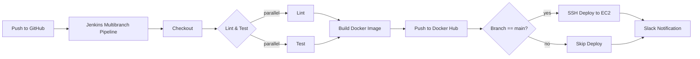
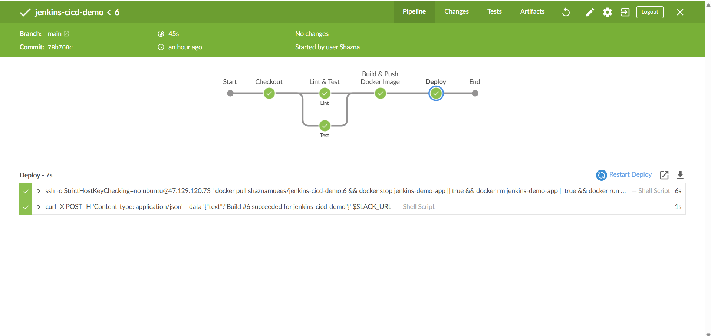

# 🔧 jenkins-cicd-demo — Self-Hosted Jenkins CI/CD Pipeline

A self-hosted Jenkins server running on AWS EC2, with a full declarative pipeline: parallel lint/test, Docker build and push to Docker Hub, SSH-based deployment, and Slack notifications — all triggered automatically via a Multibranch Pipeline connected to GitHub.

---

## What This Project Demonstrates

- **Self-hosted CI/CD** — Jenkins running in Docker on EC2, configured from scratch (plugins, credentials, Multibranch Pipeline)
- **Declarative Jenkinsfile** — parallel stages, environment variables, conditional branch logic
- **Secure credential management** — GitHub token, Docker Hub token, SSH key, and Slack webhook all stored as Jenkins credentials, never hardcoded
- **Docker-in-Jenkins** — Jenkins builds and pushes Docker images from inside its own container
- **Automated SSH deployment** — pipeline deploys directly to a remote EC2 host via `sshagent`
- **Slack integration** — real-time build success/failure notifications
- **Branch-aware deployment** — deploy stage only runs on `main`, keeping feature branches safe from accidental production deploys

---

## Architecture



---

## Pipeline in Action



All five stages — Checkout, Lint & Test (parallel), Build & Push Docker Image, Deploy — completing successfully, with the actual deploy and Slack notification commands visible in the log.

---

## Tech Stack

| Layer | Technology |
|---|---|
| App | FastAPI (Python) |
| CI/CD | Jenkins (self-hosted, Docker) |
| Pipeline | Declarative Jenkinsfile (Groovy DSL) |
| Containerization | Docker (multi-stage build) |
| Image Registry | Docker Hub |
| Deployment Target | AWS EC2 |
| Notifications | Slack (Incoming Webhook) |
| Source Control | GitHub (Multibranch Pipeline) |

---

## Pipeline Stages

1. **Checkout** — pulls the latest code from the triggering branch
2. **Lint & Test** (parallel) — runs `flake8` and `pytest` simultaneously to save pipeline time
3. **Build & Push Docker Image** — builds a multi-stage Docker image, tags it with the Jenkins build number, pushes to Docker Hub
4. **Deploy** *(main branch only)* — SSHes into the EC2 host, pulls the new image, stops/removes the old container, starts the new one
5. **Post Actions** — sends a Slack notification reporting success or failure, regardless of outcome

---

## Credentials Used (Jenkins Credentials Store)

| ID | Type | Purpose |
|---|---|---|
| `github-creds` | Username/Password | Multibranch Pipeline GitHub access |
| `dockerhub-creds` | Username/Password | Docker Hub login for image push |
| `ec2-ssh-key` | SSH Private Key | Deploying to EC2 via SSH |
| `slack-webhook` | Secret Text | Posting build notifications to Slack |

None of these are hardcoded anywhere in the Jenkinsfile — all referenced by ID and injected at runtime via `withCredentials` / `sshagent`.

---

## Local Setup

### Run Jenkins
```bash
docker run -d -p 8080:8080 -p 50000:50000 --name jenkins \
  -v jenkins_home:/var/jenkins_home \
  -v /var/run/docker.sock:/var/run/docker.sock \
  jenkins/jenkins:lts
```

### App (for local testing outside the pipeline)
```bash
python -m venv venv
venv\Scripts\activate
pip install -r requirements.txt
uvicorn app.main:app --reload
```

---

## What I Learned

- Setting up a Multibranch Pipeline and connecting it securely to GitHub via a scoped token
- Why a container needs the Docker CLI **and** matching group permissions (not just the Docker socket mounted) to run `docker build`/`docker push` from inside itself
- Diagnosing a real GID mismatch between a container's internal `docker` group and the host's actual group owning `/var/run/docker.sock`
- The difference between the **SSH Build Agents** plugin and the **SSH Agent** plugin — only the latter provides the `sshagent` pipeline step
- Why `--restart unless-stopped` matters for both the Jenkins container and any deployed app container, especially on infrastructure that can reboot unexpectedly
- Declarative `when { branch 'main' }` conditions to prevent feature branches from auto-deploying

---

## Author

**Shazna Muees**
Software Engineer
[GitHub](https://github.com/shaznamuees1-dev) · [LinkedIn](https://www.linkedin.com/in/shaznamuees/)
